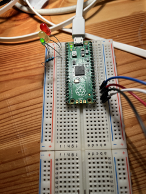
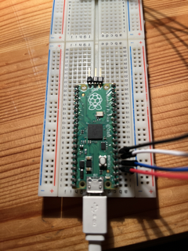
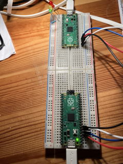
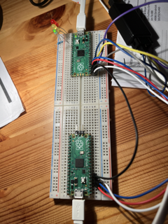

# Time Critical Datatransmission

## Fragestellungen

- Was ist ein SPI-Bus und wie ist dieser aufgebaut?
  
  > Serial Peripheral Interface (SPI) ist ein auf dem Master-Slave basierendes synchrones Bussystem. SPI ist vollduplex fähig, also es kann gleichzeitig gesendet und empfangen werden. 
  > 
  > Theoretisch kann man an einen SPI Bus unendlich viele Teilnehmer hängen (max. 1 Master, viele Slaves). Für jeden zusätzlichen Teilnehmer wird lediglich ein zusätzlich ChipSelect benötigt.
  > 
  > Ganz generell benötigt man für SPI vier Anschlüsse:
  > 
  > - MOSI (**M**aster **O**ut -> **S**lave **I**n)
  > 
  > - MISO (**M**aster **I**n <- **S**lave **O**ut)
  > 
  > - SCK (Serial Clock)
  > 
  > - CS (Chip Select)
  > 
  > Mithilfe des Chip Select gibt der Master an, welcher Slave sprechen darf. Es kann immer nur ein Slave gleichzeitig sprechen. (Der Master setzt den CS entweder HIGH oder LOW)
  > 
  > Der SPI Bus ermöglicht umfangreiche Einstellungen, unter anderem kann man die Taktfrequenz und die Bit länge der Übertragung selbstständig konfigurieren.
  > 
  > [6][3]

- Welche Vorteile ergeben sich bei der Verwendung eines Kommunikationsbusses?
  
  > Die Bus-Topologie ist eine Art Netzwerktopologie, die mehrere Vorteile bietet. Einer der Vorteile ist, dass es sehr einfach ist, ein neues Gerät mit dem Netzwerk zu verbinden, solange das Gerät über den passenden Anschlussmechanismus verfügt. Das neue Gerät wird einfach mit der linearen Bus-Topologie verbunden und ist sofort Teil des Netzwerks. 
  > 
  > Ein weiterer Vorteil der Bus-Topologie ist, dass sie im Vergleich zu anderen Netzwerkoptionen wie Ring-, Stern- oder Hybridnetzwerken am günstigsten umzusetzen ist. Denn sie erfordert weniger Kabel als die anderen Netzwerkoptionen. 
  > 
  > Ein weiterer wichtiger Vorteil der Bus-Topologie ist, dass der Ausfall einer Station keinen Einfluss auf den Rest des Netzwerks hat. 
  > 
  > Ein weiterer Vorteil der Bus-Topologie ist, dass keine Hubs oder Switches benötigt werden. Im Vergleich zu anderen Setups lässt dies weniger potenzielle Fehlerquellen zu.
  > 
  > Schließlich ist ein weiterer Vorteil der Bus-Topologie, dass sie einfach erweitert werden kann. Obwohl die Größe und Reichweite der Bus-Topologie naturgemäß begrenzt ist, kann sie sehr einfach erweitert werden. Obwohl dies die Anzahl der möglichen Paketkollisionen erhöhen kann, ist es eine vereinfachte Lösung. [7]

- Welche Möglichkeiten der Beschaltung sind beim SPI-Bus möglich und wie wirkt sich die Clock darauf aus?
  
  > Beim Anschluss von Geräten an den SPI-Bus gibt es verschiedene Möglichkeiten der Beschaltung. Der Bus kann entweder im Voll-Duplex- oder im Half-Duplex-Modus betrieben werden. Im Voll-Duplex-Modus können Daten in beide Richtungen gleichzeitig übertragen werden, während im Half-Duplex-Modus Daten nur in eine Richtung übertragen werden können.
  > 
  > Ein weiterer wichtiger Aspekt beim SPI-Bus ist die Clock, also das Taktsignal, das die Datenübertragung steuert. Die Frequenz der Clock kann je nach Gerät und Anwendung unterschiedlich sein. Eine höhere Clock-Frequenz ermöglicht eine schnellere Datenübertragung, aber kann auch zu Problemen mit der Signalintegrität führen, wenn das Kabel oder die Leiterplatte zu lang oder zu komplex ist.
  > 
  > [6][3]

- Wie werden zeitkritische Anwendungen (real-time) eingeteilt?
  
  > Zeitkritische Anwendungen werden in Echtzeit-Systemen (Real-Time Systems) eingeteilt, die die Fähigkeit besitzen, bestimmte zeitliche Anforderungen zu erfüllen. Echtzeitsysteme lassen sich in der Regel in zwei Kategorien einteilen: 
  > 
  > - harte Echtzeitsysteme
  > 
  > - weiche Echtzeitsysteme.
  > 
  > Harte Echtzeitsysteme sind Systeme, bei denen das Nichterfüllen der zeitlichen Anforderungen katastrophale Folgen hat. In solchen Systemen müssen die Ergebnisse innerhalb eines genau definierten Zeitrahmens vorliegen. 
  > 
  > Weiche Echtzeitsysteme hingegen haben weniger kritische Anforderungen an die Zeitgenauigkeit und können in der Regel Verzögerungen tolerieren. [12]

- Wie kommt ein Watchdog bei zeitkritischen Anwendungen zum Einsatz?
  
  > Dies ist ein Countdown-Timer, der Teile des Chips neu starten kann, wenn
  >  er Null erreicht. Zum Beispiel kann dies verwendet werden, um den 
  > Prozessor neu zu starten, wenn die darauf ausgeführte Software in einer 
  > Endlosschleife oder ähnlichem stecken bleibt. Der Programmierer muss 
  > periodisch einen Wert an den Watchdog schreiben, um zu verhindern, dass 
  > er Null erreicht. [8]
  > 
  > ```c
  > #include <stdio.h>
  > #include "pico/stdlib.h"
  > #include "hardware/watchdog.h"
  > 
  > 
  > int main() {
  >     stdio_init_all();
  > 
  >     if (watchdog_caused_reboot()) {
  >         printf("Rebooted by Watchdog!\n");
  >         return 0;
  >     } else {
  >         printf("Clean boot\n");
  >     }
  > 
  >     // Enable the watchdog, requiring the watchdog to be updated every 100ms or the chip will reboot
  >     // second arg is pause on debug which means the watchdog will pause when stepping through code
  >     watchdog_enable(100, 1);
  > 
  >     for (uint i = 0; i < 5; i++) {
  >         printf("Updating watchdog %d\n", i);
  >         watchdog_update();
  >     }
  > 
  >     // Wait in an infinite loop and don't update the watchdog so it reboots us
  >     printf("Waiting to be rebooted by watchdog\n");
  >     while(1);
  > }
  > ```

- Wie kann man Interrupts priorisieren?
  
  > Jede Task wird eine Priorität von 0 bis (configMAX_PRIORITIES - 1) 
  > zugewiesen, wobei configMAX_PRIORITIES in FreeRTOSConfig.h definiert 
  > ist.
  > 
  > Wenn der verwendete Port einen portoptimierten Task-Auswahlmechanismus 
  > implementiert, der eine "Count Leading Zeros"-Typ-Anweisung (für die 
  > Task-Auswahl in einer einzigen Anweisung) verwendet und 
  > configUSE_PORT_OPTIMISED_TASK_SELECTION in FreeRTOSConfig.h auf 1 
  > gesetzt ist, kann configMAX_PRIORITIES nicht höher als 32 sein. In allen
  >  anderen Fällen kann configMAX_PRIORITIES jeden vernünftigen Wert 
  > annehmen - sollte aber aus Gründen der RAM-Nutzungseffizienz auf den 
  > minimalen tatsächlich notwendigen Wert reduziert werden. [9]
  > 
  > `vTaskPrioritySet` [10]
  > 
  > ```c
  > #include <stdio.h>
  > #include "pico/stdlib.h"
  > #include "pico/multicore.h"
  > #include "pico/time.h"
  > #include "hardware/spi.h"
  > #include "FreeRTOS.h"
  > #include "task.h"
  > 
  > #define PIN_SCK  18
  > #define PIN_MOSI 19
  > #define PIN_MISO 16
  > #define PIN_CS   17
  > 
  > #define SPI_PORT spi0
  > #define SPI_BAUDRATE 1000000
  > 
  > #define TASK1_PRIORITY 3
  > #define TASK2_PRIORITY 2
  > 
  > SemaphoreHandle_t spi_mutex;
  > 
  > void spi_task(void *params) {
  >     while (true) {
  >         if (xSemaphoreTake(spi_mutex, portMAX_DELAY) == pdTRUE) {
  >             uint8_t tx_buf[1] = {0x01};
  >             uint8_t rx_buf[1] = {0};
  >             spi_write_read_blocking(SPI_PORT, tx_buf, rx_buf, sizeof(tx_buf));
  >             printf("Received SPI data: %d\n", rx_buf[0]);
  >             xSemaphoreGive(spi_mutex);
  >         }
  >         vTaskDelay(pdMS_TO_TICKS(500));
  >     }
  > }
  > 
  > void high_priority_task(void *params) {
  >     while (true) {
  >         printf("High priority task running.\n");
  >         vTaskDelay(pdMS_TO_TICKS(500));
  >     }
  > }
  > 
  > void low_priority_task(void *params) {
  >     while (true) {
  >         printf("Low priority task running.\n");
  >         vTaskDelay(pdMS_TO_TICKS(500));
  >     }
  > }
  > 
  > void spi_isr() {
  >     BaseType_t xHigherPriorityTaskWoken = pdFALSE;
  >     vTaskPrioritySet(NULL, TASK1_PRIORITY);
  >     xSemaphoreGiveFromISR(spi_mutex, &xHigherPriorityTaskWoken);
  >     if (xHigherPriorityTaskWoken == pdTRUE) {
  >         portYIELD_FROM_ISR();
  >     }
  > }
  > 
  > int main() {
  >     stdio_init_all();
  >     spi_init(SPI_PORT, SPI_BAUDRATE);
  >     gpio_set_function(PIN_SCK, GPIO_FUNC_SPI);
  >     gpio_set_function(PIN_MOSI, GPIO_FUNC_SPI);
  >     gpio_set_function(PIN_MISO, GPIO_FUNC_SPI);
  >     gpio_set_function(PIN_CS, GPIO_FUNC_SPI_CS);
  >     spi_set_format(SPI_PORT, 8, SPI_CPOL_0, SPI_CPHA_0, SPI_MSB_FIRST);
  >     spi_set_slave_mode(SPI_PORT, false);
  >     spi_set_cs_polarity(SPI_PORT, 0, false);
  >     spi_gpio_init(PIN_CS);
  > 
  >     spi_mutex = xSemaphoreCreateMutex();
  > 
  >     xTaskCreate(spi_task, "SPI Task", configMINIMAL_STACK_SIZE, NULL, tskIDLE_PRIORITY + 1, NULL);
  >     xTaskCreate(high_priority_task, "High Priority Task", configMINIMAL_STACK_SIZE, NULL, TASK1_PRIORITY, NULL);
  >     xTaskCreate(low_priority_task, "Low Priority Task", configMINIMAL_STACK_SIZE, NULL, TASK2_PRIORITY, NULL);
  > 
  >     gpio_set_irq_enabled_with_callback(PIN_MISO, GPIO_IRQ_EDGE_RISE, true, &spi_isr);
  > 
  >     vTaskStartScheduler();
  > 
  >     return 0;
  > }
  > ```

- Was sind Real-Time Operating-Systems (RTOS) und wie kann man diese auf Mikrokontrollern einsetzen?
  
  > Real-Time Operating-Systems (RTOS) sind spezialisierte Betriebssysteme, die für die Verarbeitung von Echtzeit-Anwendungen optimiert sind. Im Gegensatz zu allgemeinen Betriebssystemen, die darauf ausgelegt sind, mehrere Aufgaben gleichzeitig auszuführen und eine umfangreiche Benutzeroberfläche bereitzustellen, liegt der Fokus von RTOS auf der zuverlässigen Ausführung von Aufgaben innerhalb von bestimmten zeitlichen Vorgaben.
  > 
  > RTOS ermöglichen es, komplexe Echtzeit-Anwendungen auf Mikrokontrollern auszuführen, die normalerweise nicht in der Lage wären, diese Aufgaben alleine zu bewältigen. RTOS bieten auch Mechanismen zur Priorisierung und Planung von Aufgaben, um sicherzustellen, dass die wichtigsten Aufgaben zuerst ausgeführt werden. [11]

#### Borkos blöde Fragen


Die Default Taktfrequenz vom Pico beträgt **12MHz**

**Interrupts vs DMA**
-> Interrupts hat einen Interrupthandler der alles blockiert
-> DMA macht das im Hintergrund der in den Buffer schreibt und Prozessor entlastet

**Interrupts**
Wenn bei SPI die Interrupt Flag gesetzt wird wird diese behandelt. Wenn ein neuer Interrupt mit höherer Priorität rein kommt, dann wird der aktuelle Interrupt unterbrochen und der mit der höchsten Priorität ausgeführt.

Nach dem ausführen wird die Flag gecleared. Danach springt man zurück zur unterbrochenen Funktion die ausgeführt wird, auch wenn die Flag von diesem Interrupt schon gecleared wurde.

## Implementierung

### Setup

Für die Übung wurden folgende Komponenten benötigt:

- 2x Raspberry Pico

- 1x Rote LED

- 1x Gelbe LED

- 1x Grüne LED

- 1x 330 Ohm Widerstand

- 4x Männlich-Männlich Kabel

- 2x Micro-USB Kabel

- 1x Logic Analyzer

- 4x Männlich-Weiblich Kabel

- 1x Steckbrett

**Verkabelung:**

Für einen SPI Bus benötigt man vier Verbindungen. [3]

1. MISO (RX)

2. MOSI (TX)

3. SC (SCn)

4. SCK (SCKL)

Der erste Schritt ist daher am PinOut [1] die notwendigen Anschlüsse/Pins zu identifizieren und die beiden PICO's miteinander zu verkabeln. In meinem Fall habe ich folgende Pins gewählt:

| PICO 1 (Slave)  | PICO 2 (Master) | Analyser | Kabelfarbe |
| --------------- | --------------- | -------- | ---------- |
| GP18 (SPI0 SCK) | GP2 (SPI0 SCK)  | LILA     | ROT        |
| GP19 (SPI0 TX)  | GP0 (SPI0 RX)   | GELB     | BLAU       |
| GP16 (SPI0 RX)  | GP3 (SPI0 TX)   | GRAU     | WEISS      |
| GP17 (SPI0 CSn) | GP1 (SPI0 CSn)  | BLAU     | SCHWARZ    |

Wichtig zu beachten ist hier, dass man immer den selben SPI (in meinem Fall SPI0) wählt. Auch wichtig ist, dass TX und RX gekreuzt verkabelt werden. (DMA)

Da wir eine Ampelschaltung bauen möchten, müssen wir natürlich auch noch die LED's richtig am Slave installieren. Da LED's einen Minus und einen Plus Pol (Anode und Kathode) haben, gilt es zunächst einmal herauszufinden was Anode und was Kathode ist. [2]

Anschließend benötigt man lediglich drei GPIO Ports (in meinem Fall GP0, GP1 und GP2) und schließt die Anode an diese Ports an. 

Anschließend benötigt man nur noch einen Widerstand, damit die LED's nicht kaputt gehen, auch diesen schließt man an einen beliebigen GND Port an. 







**Software**

Um die PICO's programmieren zu können benötigen wir eine angemessene Entwicklungsumgebung. Daher ist es ratsam das `pico-template` [4] von Prof. Michael Borko zu clonen und die Installationsschritte darin zu befolgen.

Funktioniert alles wie beschrieben ist man mit dem Setup fertig und kann an die Entwicklung gehen.

**Logic Analyzer**

Beim Logic Analyzer ist es eigentlich nur wichtig, die Pin Belegung richtig zu konfigurieren und anschließend den Analyzer auch an die korrekten Pins anzustecken.



### Entwicklung

#### Slave

Bevor man beginnt sollte man sicherstellen, dass man weiß wie eine Ampel funktioniert. Sowohl im normal Zustand, als auch im Fehlerfall oder Startvorgang. [5]

Hat man das verstanden, kann man beginnen zu entwickeln. 

Im pico-template erstellt man einen neuen Ordner (`ampel-freertos-slave`) und in diesem zwei Files (`main.c`, `CMakeLists.txt`). Das CMakeLists kann aus den anderen Beispielen im Template kopiert werden. Wichtig ist nur, dass die richtigen Libraries gelinkt werden:

```cmake
target_link_libraries(ampel-freertos-slave pico_stdlib hardware_spi hardware_dma pico_multicore FreeRTOS)
```

Im `main.c` kommt der eigentlich wichtige Teil unsere Software hin und ist daher auch wesentlich umfangreicher.

Im Ersten Schritt sollten wir uns darum kümmern, dass unsere Ampel mal funktioniert, ob etwas über den SPI Bus verschickt wird ist uns da mal egal.

**Ampel**

Wir wollen unsere Ampelschaltung möglichst schön implementieren, daher benutzen wir Funktionen, die über einen Pointer übergeben werden und ihren State setzen => StateManagement.

Daher definieren wir unsere States und die Anzahl:

```c
#define NUM_STATES 7

typedef enum {
    STATE_YELLOW_BLINKING,
    STATE_YELLOW,
    STATE_RED,
    STATE_RED_YELLOW,
    STATE_GREEN,
    STATE_GREEN_BLINKING,
    STATE_ERROR,
} State;
```

Außerdem braucht es einen default Zustand:

```c
State state = STATE_ERROR;
```

Des weiteren brauchen wir unsere LED Pins, da wir diese ja Ein- und Ausschalten möchten:

```c
#define LIGHT_RED    0
#define LIGHT_YELLOW 1
#define LIGHT_GREEN  2
#define PICO_DEFAULT_LED_PIN 25


static const int pins[] = {
    LIGHT_RED,
    LIGHT_YELLOW,
    LIGHT_GREEN,
};
```

Der PICO_DEFAULT_LED_PIN ist die LED die direkt am PICO installiert ist.

Als nächstes Überlegen wir uns, wie lange jeder Zustand der Ampel hält, bzw. was dieser Zustand für Timings hat. Diese definieren wir dann ebenfalls:

```c
#define DURATION_YELLOW_BLINKING 500
#define DURATION_YELLOW          4000
#define DURATION_RED             5000
#define DURATION_RED_YELLOW      4000
#define DURATION_GREEN           5000
#define DURATION_GREEN_BLINKING  500
```

Nun haben wir alle notwendigen Informationen initialisiert und können mit dem Code beginnen.

Das wichtigste zuerst: Die Pins initialisieren, sodass wir sie verwenden können. Dafür haben wir eine eigene Methode erstellt:

```c
static void init_pins(void) {
    gpio_init(PICO_DEFAULT_LED_PIN);
    gpio_set_dir(PICO_DEFAULT_LED_PIN, GPIO_OUT);
    
    for (int i = 0; i < sizeof(pins) / sizeof(pins[0]); i++) {
        gpio_init(pins[i]);
        gpio_set_dir(pins[i], GPIO_OUT);
    }
}
```

Nun können wir uns daran setzen, die einzelnen Funktionen für die verschiedenen Ampelstates zu erstellen. (ACHTUNG: `vTaskDelay` ist bereits eine freeRTOS methode und sollte mit `sleep_ms` ersetzt werden sofern man kein freeRTOS verwendet.)

```c
static void state_error(void) {
    gpio_put(PICO_DEFAULT_LED_PIN, 1);
    gpio_put(pins[LIGHT_YELLOW], 1);
    vTaskDelay(DURATION_YELLOW_BLINKING);
    gpio_put(pins[LIGHT_YELLOW], 0);
    vTaskDelay(DURATION_YELLOW_BLINKING);
}

static void state_yellow_blinking(void) {
    for (int i = 0; i < 10; i++) {
        gpio_put(pins[LIGHT_YELLOW], 1);
        vTaskDelay(DURATION_YELLOW_BLINKING);
        gpio_put(pins[LIGHT_YELLOW], 0);
        vTaskDelay(DURATION_YELLOW_BLINKING);
    }

    state = STATE_RED;
}

static void state_yellow(void) {
    gpio_put(pins[LIGHT_YELLOW], 1);

    vTaskDelay(DURATION_YELLOW);
    state = STATE_RED;
}

static void state_red(void) {
    gpio_put(pins[LIGHT_RED], 1);

    vTaskDelay(DURATION_RED);
    state = STATE_RED_YELLOW;
}

static void state_red_yellow(void) {
    gpio_put(pins[LIGHT_RED], 1);
    gpio_put(pins[LIGHT_YELLOW], 1);

    vTaskDelay(DURATION_RED_YELLOW);
    state = STATE_GREEN;
}

static void state_green(void)
{
    gpio_put(pins[LIGHT_GREEN], 1);

    vTaskDelay(DURATION_GREEN);
    state = STATE_GREEN_BLINKING;
}

static void state_green_blinking(void)
{
    for (int i = 0; i < 4; i++) {
        gpio_put(pins[LIGHT_GREEN], 0);
        vTaskDelay(DURATION_GREEN_BLINKING);
        gpio_put(pins[LIGHT_GREEN], 1);
        vTaskDelay(DURATION_GREEN_BLINKING);
    }

    state = STATE_YELLOW;
}
```

Dann noch die Referenzen speichern:

```c
typedef void (*State_Function)(void);

static void state_yellow_blinking(void);
static void state_yellow(void);
static void state_red(void);
static void state_red_yellow(void);
static void state_green(void);
static void state_green_blinking(void);
static void state_error(void);

static State_Function state_functions[NUM_STATES] = {
    state_yellow_blinking,
    state_yellow,
    state_red,
    state_red_yellow,
    state_green,
    state_green_blinking,
    state_error,
};
```

Die Ampel sollte nun bereits funktionieren, alles was fehlt ist die Main Methode. Jedoch möchten wir regelmäßig den aktuellen Status über den SPI Bus verschicken, weswegen wir zu unserem nächsten Schritt kommen.

**SPI**

Für den SPI Bus müssen wir zunächst wieder einige Variablen instanzieren.

```c
#define PIN_SCK 18 //sck
#define PIN_CS 17 //cs
#define PIN_RX 16 //miso
#define PIN_TX 19 //mosi
```

Anschließend müssen wir den SPI Bus wiederum initialisieren (und DMA), wofür wir auch eine eigene Funktion erstellt haben. Besonders wichtig ist hier, dass der SPI Mode auf slave gesetzt wird:

```c
static void init_spi(void) {
    spi_init(spi0, 1000*1000); 
    spi_set_slave(spi0, true);
    gpio_set_function(PIN_RX, GPIO_FUNC_SPI);
    gpio_set_function(PIN_CS, GPIO_FUNC_SPI);
    gpio_set_function(PIN_SCK, GPIO_FUNC_SPI);
    gpio_set_function(PIN_TX, GPIO_FUNC_SPI);

    dma_cfg = dma_channel_get_default_config(spi_get_index(spi0));
    channel_config_set_transfer_data_size(&dma_cfg, DMA_SIZE_8);
    channel_config_set_dreq(&dma_cfg, DREQ_SPI0_RX);
    channel_config_set_write_increment(&dma_cfg, true);
    channel_config_set_read_increment(&dma_cfg, true);
} 
```

Theoretisch könnte man nun bereits über den SPI Bus senden, jedoch haben wir aktuell ein enormes Problem: Die Task delays würden ein senden über den SPI Bus immer wieder verzögern oder verhindern. Daher benötigen wir mehrere Tasks die Asynchron laufen können. 

**Watchdog / FreeRTOS**

Hier müssen wir zunächst auch wieder einige Definitionen erstellen. Aus der Aufgabenstellung entnehmen wir folgende Codes für die einzelnen Stati:

| Status        | Code    |
| ------------- | ------- |
| Rot           | 1-1-1-0 |
| Rot-Gelb      | 1-1-0-1 |
| Grün          | 0-0-1-0 |
| Grün blinkend | 0-1-0-1 |
| Gelb          | 1-0-0-0 |
| Gelb blinkend | 0-0-0-1 |

Diese haben wir in Hex Code codiert:

```c
#define STATUS_RED            0xE
#define STATUS_RED_YELLOW     0xD
#define STATUS_GREEN          0x2
#define STATUS_GREEN_BLINKING 0x5
#define STATUS_YELLOW          0x8
#define STATUS_YELLOW_BLINKING 0x1
#define ERROR_CODE 0xF
#define SUCCESS_CODE 0x7
```

Des weiteren benötigen wir eine Hashmap die jeden dieser Codes einem Status zuordnet:

```c
typedef struct {
    State state;
    uint8_t status;
} StateStatusPair;

static StateStatusPair stateStatusMap[] = {
    { STATE_YELLOW_BLINKING, STATUS_YELLOW_BLINKING },
    { STATE_YELLOW, STATUS_YELLOW },
    { STATE_RED, STATUS_RED },
    { STATE_RED_YELLOW, STATUS_RED_YELLOW },
    { STATE_GREEN, STATUS_GREEN },
    { STATE_GREEN_BLINKING, STATUS_GREEN_BLINKING },
    { STATE_ERROR, ERROR_CODE},
};

static uint8_t getStatusForState(State state) {
    for (int i = 0; i < NUM_STATES; i++) {
        if (stateStatusMap[i].state == state) {
            return stateStatusMap[i].status;
        }
    }
    return -1;
}
```

Und weil wir zwei Tasks benötigen definieren wir auch gleich die beiden Task Variablen:

```c
TaskHandle_t tsDataTransmitter = NULL;
TaskHandle_t tsStateHandler = NULL;
dma_channel_config dma_cfg;
```

Danach erstellen wir die StateManager Funktion:

```c
void tHandleState(void* p) {
    while (true) {
        for (int i = 0; i < sizeof(pins) / sizeof(pins[0]); i++) {
            gpio_put(pins[i], 0);
        }
        state_functions[state]();
    }
}
```

Das Daten versenden ist dann wesentlich komplexer, hier müssen wir nämlich nicht nur die Daten über den SPI Bus verschicken, sondern auch darauf achten, was zurückkommt, den watchdog aktualisieren und im Fehlerfall in den Fehlermode gehen und die Ampel herunterfahren.

```c
void tTransmitState(void* p) {
    uint8_t rx_buffer[1];
    while (true) {
        if (state != STATE_ERROR)
        {
            gpio_put(PICO_DEFAULT_LED_PIN, 1);

            uint8_t send_buf[1] = {getStatusForState(state)};
            const uint dma_channel = dma_claim_unused_channel(true);
            dma_channel_start(dma_channel);

            dma_channel_configure(
                dma_channel, &dma_cfg,
                &spi_get_hw(spi0)->dr, 
                send_buf, 
                sizeof(send_buf), 
                true 
            );

            dma_channel_wait_for_finish_blocking(dma_channel);

            const uint dma_read = dma_claim_unused_channel(true);
            dma_channel_start(dma_read);
            dma_channel_configure(
                dma_read, &dma_cfg,
                rx_buffer,
                &spi_get_hw(spi0)->dr,
                sizeof(rx_buffer),
                true
            );

            dma_channel_wait_for_finish_blocking(dma_read);

            if (rx_buffer[0] != ERROR_CODE)
            {
                watchdog_update();
                vTaskDelay(10);
                gpio_put(PICO_DEFAULT_LED_PIN, 0);
                vTaskDelay(10);
            }

            dma_channel_unclaim(dma_channel);
            dma_channel_unclaim(dma_read);
        } else {
            if (gpio_get(PIN_CS))
            {
                state = STATE_YELLOW_BLINKING;
            } 
            watchdog_update();
            vTaskDelay(30);
        }
    }
}
```

Das einzige was uns jetzt noch Fehlt ist die Main Methode. Diese ist ziemlich simpel:

```c
int main() {
    init_pins();
    init_spi();

    if (!watchdog_caused_reboot()) {
        state = STATE_YELLOW_BLINKING;
    } 

    watchdog_enable(60, false);

    xTaskCreate(tTransmitState, "dataTransmitter", 1024, NULL, 1, &tsDataTransmitter);
    xTaskCreate(tHandleState, "stateHandler", 1024, NULL, 1, &tsStateHandler);
    vTaskStartScheduler();

    while (true)
    {
        //never reached
    }
}
```

#### Master

Der Master ist dafür da, um sicherzustellen, dass der Slave die Ampel richtig besteuert und alles funktioniert.  

Das Grundlegende Setup ist ident wie beim Slave.

**SPI**

Auch hier müssen zunächst die Pins definiert werden:

```c
#define PIN_SCK 2 //sck
#define PIN_CS 1 //cs
#define PIN_RX 0 //miso
#define PIN_TX 3 //mosi
```

Anschließend werden sie mit fast der selben Funktion wie beim slave initialisiert. (Achtung: Slave Modus wird nun deaktiviert -> ist ja der Master)

```c
static void init_spi(void) {
    spi_init(spi0, 1000*1000);
    spi_set_slave(spi0, false);
    gpio_set_function(PIN_RX, GPIO_FUNC_SPI);
    gpio_set_function(PIN_CS, GPIO_FUNC_SPI);
    gpio_set_function(PIN_SCK, GPIO_FUNC_SPI);
    gpio_set_function(PIN_TX, GPIO_FUNC_SPI);

    dma_cfg = dma_channel_get_default_config(spi_get_index(spi0));
    channel_config_set_transfer_data_size(&dma_cfg, DMA_SIZE_8);
    channel_config_set_dreq(&dma_cfg, spi_get_index(spi0) ? DREQ_SPI1_TX : DREQ_SPI0_TX);
    channel_config_set_read_increment(&dma_cfg, true);
    channel_config_set_write_increment(&dma_cfg, true);
} 
```

**LED**

Auch beim Master PICO verwenden wir die Default LED, daher müssen wir folgendes definieren:

```c
#define ERROR_CODE 0xF
#define SUCCESS_CODE 0x7
#define PICO_DEFAULT_LED_PIN 25
```

und die initalisierungs Funktion:

```c
static void init_pins(void) {
    gpio_init(PICO_DEFAULT_LED_PIN);
    gpio_set_dir(PICO_DEFAULT_LED_PIN, GPIO_OUT);
}
```

**FreeRTOS**

Zusätzlich zu zwei Tasks definieren wir eine Variable für den Timestamp:

```c
TaskHandle_t tsDataHandler = NULL;
TaskHandle_t tsBlinker = NULL;
TickType_t timestamp = 0;
dma_channel_config dma_cfg;
```

Dann einen `blinker` Task, welcher lediglich dafür sorgt, dass die LED blinkt:

```c
void tBlinker(void* p) {
    while (true) {
        vTaskDelay(30);
        gpio_put(PICO_DEFAULT_LED_PIN, 1);
        vTaskDelay(30);
        gpio_put(PICO_DEFAULT_LED_PIN, 0);
    }
}
```

Und einen etwas komplexeren DataHandler Task:

```c
void tDataHandler(void* p) {
    uint8_t buffer[1];
    while (true) {
        const uint dma_channel = dma_claim_unused_channel(true);
        dma_channel_start(dma_channel);
        dma_channel_configure(
            dma_channel, 
            &dma_cfg,
            buffer, 
            &spi_get_hw(spi0)->dr,  
            sizeof(buffer), 
            true  
        );

        dma_channel_wait_for_finish_blocking(dma_channel);
        
        const uint dma_write = dma_claim_unused_channel(true);
        dma_channel_start(dma_write);
        if ((xTaskGetTickCount() - timestamp) > pdMS_TO_TICKS(60))
        {
            uint8_t send[1] = {ERROR_CODE};
            dma_channel_configure(
                dma_write, 
                &dma_cfg,
                &spi_get_hw(spi0)->dr,
                send,
                sizeof(send), 
                true 
            );
        } else {
            uint8_t send[1] = {SUCCESS_CODE};
            dma_channel_configure(
                dma_write, 
                &dma_cfg,
                &spi_get_hw(spi0)->dr,
                send,
                sizeof(send), 
                true 
            );
        }
        dma_channel_wait_for_finish_blocking(dma_write);
        dma_channel_unclaim(dma_write);
        dma_channel_unclaim(dma_channel);
        vTaskDelay(30);
        timestamp = xTaskGetTickCount();
    }
}
```

Dieser speichert vor dem empfangen die aktuelle Zeit um später zu kontrollieren ob der Slave innerhalb von 60ms einen State transferiert hat. Wenn nicht wird ein ErrorCode verschickt.

Was nun noch fehlt ist die `main` Methode:

```c
int main() {
    init_pins();
    init_spi();

    xTaskCreate(tDataHandler, "dataHandler", 1024, NULL, 2, &tsDataHandler);
    xTaskCreate(tBlinker, "blinkHandler", 1024, NULL, 1, &tsBlinker);
    vTaskStartScheduler();

    while (true)
    {
        //never reached
    }
}
```

## Quellen

[1] "Raspberry Pi Pico Pinout"; "raspberrypi.com"; [Link](https://datasheets.raspberrypi.com/pico/Pico-R3-A4-Pinout.pdf); zuletzt besucht am 03.03.2023

[2] "IDENTIFY THE ANODE/CATHODE of LED's"; "instructables.com"; [Link](https://www.instructables.com/IDENTIFY-THE-ANODECATHODE-of-LEDs/); zuletzt besucht am 03.03.2023

[3] "Serial Peripheral Interface"; "mikrocontroller.net"; [Link](https://www.mikrocontroller.net/articles/Serial_Peripheral_Interface); zuletzt besucht am 03.03.2023

[4] "Raspberry Pi RP2040 Template"; "Michael Borko"; [Link](https://github.com/mborko/pico-template); zuletzt besucht am 03.03.2023

[5] "Kleine Ampelkunde - Lichtzeichen"; "wien.gv.at"; [Link](https://www.wien.gv.at/verkehr/ampeln/ampelkunde.html); zuletzt besucht am 03.03.2023

[6] "Serial Peripheral Interface"; "wikipedia.org"; [Link](https://de.wikipedia.org/wiki/Serial_Peripheral_Interface); zuletzt besucht am 04.03.2023

[7] "17 Advantages and Disadvantages of Bus Topology"; "vittana.org"; [Link](https://vittana.org/17-advantages-and-disadvantages-of-bus-topology); zuletzt besucht am 04.03.2023

[8] "hardware_watchdog"; "raspberrypi.com"; [Link](https://www.raspberrypi.com/documentation/pico-sdk/hardware.html#hardware_watchdog); zuletzt besucht am 04.03.2023

[9] "Task Priorities"; "freertos.org"; [Link](https://www.freertos.org/RTOS-task-priority.html); zuletzt besucht am 04.03.2023

[10] "vTaskPrioritySet"; "freertos.org"; [Link](https://www.freertos.org/a00129.html); zuletzt besucht am 04.03.2023

[11] "Echtzeitbetriebssysteme (RTOS) und ihre Anwendungen"; "digikey.de"; [Link](https://www.digikey.de/de/articles/real-time-operating-systems-and-their-applications); zuletzt besucht am 04.03.2023

[12] "Echtzeit: Grundlagen von Echtzeitsystemen"; "embedded-software-engineering.de"; [Link](https://www.embedded-software-engineering.de/echtzeit-grundlagen-von-echtzeitsystemen-a-5897f8abe8f52370ee04a724b23339f8/); zuletzt besucht am 04.03.2023
